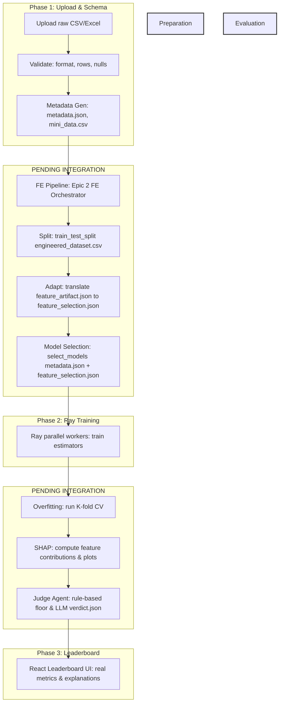

# Plan: MITRA End-to-End Demo Integration Tasks

**Timestamp:** 2026-06-18_16:10:00  
**Authors:** Antigravity AI  

This document outlines the detailed low-level task roadmap required to integrate the individual components of MITRA across all epics (Epics 1, 2, 3, 4, and Frontend) to demonstrate a complete, functional end-to-end demo.

---

## 1. COMPONENT STATUS SUMMARIES

### Phase 1 (Upload, Validate, Metadata Gen - Epic 1 & Backend)
*   **Status:** **100% Implemented**.
*   **Features:** Handles dataset uploads (`POST /api/upload`), converts Excel format to canonical `data.csv`, extracts `mini_data.csv`, executes rule-based validation (`POST /api/validate`), and runs the LLM metadata agent (`POST /api/metadata`) to output `metadata.json`. Exposes event streams via memory-based SSE loops.

### Phase 2 (Preprocessing & Feature Engineering - Epic 2)
*   **Status:** **Operational in Standalone mode**.
*   **Features:** Implements sequential ADK tool pipeline (Profiler, SemanticTypeInfer, Imputer, OutlierHandler, FeatureCreator, Encoder, Scaler, FeatureSelector, FeatureValidator, FeatureReporter).
*   **Gaps:** Disconnected from the backend API/routers. No splitting mechanism exists to divide the dataset into `train.csv` and `test.csv`.

### Phase 3 (Model Selection & Ray Training - Epic 3)
*   **Status:** **Operational in Standalone mode**.
*   **Features:** Implements model cataloging via AST parser, deterministic model ranking/LLM-based model selection (`model_config.json` generator), Ray parallel training submission, and a queue-based SSE `TrainingEventBus`.
*   **Gaps:** Disconnected from the backend routers. Preconditions (`model_config.json`, `train.csv`, `test.csv`) are not generated by the backend, causing training starts to fail.

### Phase 4 (Evaluation, SHAP, Overfitting, dataset2Vec, & Judge - Epic 4)
*   **Status:** **Partially Operational / Standalone mode only**.
*   **Features:** Overfitting Analyzer running K-fold CV; modular SHAP explainability service; Judge Agent rule-based and LLM gating/verdict generation; Dataset2Vec contrastive embedding models.
*   **Gaps:** 
    *   No post-training coordinator/script runs overfitting, SHAP, and Judge in sequence.
    *   SHAP module lacks a CLI runner / orchestration entry point.
    *   `dataset2Vec` operates as a standalone module without integration into metadata/selection steps.
    *   No backend service routes or API endpoints expose these post-training results.

### Frontend (React/Vite SPA Client)
*   **Status:** **Page 1 & 2 Connected, Page 3 Mocked**.
*   **Features:** Live integration of Upload, Validation, Metadata logs, and training events via SSE.
*   **Gaps:** Leaderboard screen (Page 3) renders hardcoded mock items from `data.js` and does not fetch from the API.

---

## 2. INTEGRATION ARCHITECTURE GAPS

The core blocker preventing an end-to-end run is the **Preparation Gap** and **Evaluation Gap** in the backend orchestrator:

---

## 3. LOW-LEVEL TASKS & ROADMAP

### A. Core Integrations (Development)

#### [TASK-1] Pre-Training Pipeline Preparation Bridge
*   **Goal:** Bridge the gap between metadata generation and Ray training.
*   **Sub-tasks:**
    1.  Create `backend/services/pipeline_prep.py` containing a task function that executes on session startup:
        *   Instantiates and runs Epic 2's `FeatureEngineerOrchestrator` using the session's `data.csv`, `metadata.json`, and configured LLM settings.
        *   Outputs `engineered_dataset.csv` and `feature_artifact.json`.
    2.  Write an adapter function that maps the `feature_artifact.json` schema onto the Pydantic model contract for Epic 3's `feature_selection.json` (`keep`, `drop`, `engineered`, `rationale`).
    3.  Create a data splitter using `scikit-learn`'s `train_test_split` (read split ratio from `config.ini`). Save the outputs to `data/train.csv` and `data/test.csv`.
    4.  Call Epic 3's `select_models` using `metadata.json` and the adapted `feature_selection.json` to generate the `model_config.json` configuration manifest.
    5.  Integrate this helper as an asynchronous precondition hook inside `TrainingService.start()` (`backend/services/training_service.py`) before Ray workspace validation checks trigger.

#### [TASK-2] SHAP Pipeline CLI Runner
*   **Goal:** Provide an execution script for the modular SHAP service.
*   **Sub-tasks:**
    1.  Create `epic_4/SHAP/run_shap.py` to parse input parameters: `--session_id`, `--model_name`, `--pickle_file_path`, `--engineered_dataset_path`, `--output_dir`.
    2.  Instantiate `SessionContext`, load data, run validation checks, select `ExplainerFactory`, extract values, and output global metrics + visualizations (`feature_importance_bar.png` and `summary_plot.png`) to the output path.

#### [TASK-3] Post-Training Evaluation Orchestration Bridge
*   **Goal:** Automate model evaluation, explainability, and judging post-training.
*   **Sub-tasks:**
    1.  Create `epic_4/run_evaluation_pipeline.py`:
        *   Parses `--session_id` and training output directory path.
        *   Reads `training_summary.json` to extract trained model paths.
        *   Runs `OverfittingAnalyzer` on each candidate and generates overfitting report metrics.
        *   Invokes the SHAP CLI Runner on the top model candidate to export plots and metrics.
        *   Compiles overfitting metrics, model weights, and SHAP summary texts into `JudgeInput` structures.
        *   Invokes the `JudgeAgent` rule engine and LLM agent to write `judge_decision.json`.
    2.  Hook `run_evaluation_pipeline.py` into `backend/services/training_service.py` to execute as a background subprocess once Ray model training completes.

#### [TASK-4] dataset2Vec Warm-Start Integration
*   **Goal:** Integrate the dataset embedding database to recommend model candidates.
*   **Sub-tasks:**
    1.  Expose `dataset2Vec` as an available helper function in `epic_3/model_selection/agents.py`.
    2.  During model selection, load the dataset2Vec FAISS store (`index.faiss`) and search for the closest dataset embeddings matching the current dataset's metadata/description.
    3.  Inject the warm-start model/hyperparameter recommendations into the model candidate list as seed configurations.

---

### B. Router and API Integration (Development)

#### [TASK-5] Implement Evaluation and Leaderboard Endpoints
*   **Goal:** Provide endpoints for the frontend to retrieve Judge decisions and explainability files.
*   **Sub-tasks:**
    1.  Create `backend/routers/evaluation.py`:
        *   `GET /api/runs/{session_id}/leaderboard`: Aggregates validation scores, training times, and status metrics from `training_summary.json` and returns them as a ranked array.
        *   `GET /api/runs/{session_id}/verdict`: Reads and returns the final nominated champion, next-steps hints, and LLM text justification from `judge_decision.json`.
        *   `GET /api/runs/{session_id}/shap`: Returns feature SHAP importances as JSON.
    2.  Register the evaluation router inside `backend/main.py`.
    3.  Configure static directory serving in FastAPI to expose the SHAP visualization PNG files under `assets/{session_id}/`.

---

### C. Frontend Integration (Development)

#### [TASK-6] Integrate Leaderboard Screen with Backend API
*   **Goal:** Connect the Leaderboard UI screen to the newly created endpoints.
*   **Sub-tasks:**
    1.  Update `frontend/src/api/client.js` with client fetchers for `/leaderboard`, `/verdict`, and `/shap`.
    2.  Update `App.jsx` to pass the dynamic `activeSessionId` to the `<LeaderboardScreen />` component.
    3.  Replace the static dummy variables in `LeaderboardScreen.jsx` with a loading screen and standard state hooks that pull and render the actual backend values dynamically on mount.
    4.  Fetch and embed the actual SHAP feature importance plot image (`feature_importance_bar.png`) using an absolute static asset URL.

---

### D. Refactoring & Code Cleanup

#### [TASK-7] Unify `config.ini` Configuration Settings
*   **Goal:** Remove duplicate configurations to comply with project guidelines.
*   **Sub-tasks:**
    1.  Consolidate sections for `[judge]`, `[overfitting]`, and `[shap]` into the global `/home/sujithma/mitra/config.ini`.
    2.  Delete local `config.ini` files:
        *   `epic_4/judge_agent/config/config.ini`
        *   `epic_4/overfitting_analysis_tool/config/config.ini`
        *   `epic_4/dataset2Vec/config/config.ini`
        *   `epic_4/SHAP/config/config.ini`
    3.  Modify file parsers in Epic 4 modules to point directly to the parent directory path configuration loader.

#### [TASK-8] Eliminate Registry and Loader Duplications
*   **Goal:** Reuse core utilities to avoid duplication.
*   **Sub-tasks:**
    1.  Remove duplicate classification/regression model name lists inside `overfitting_analysis.py` and import `EXPECTED_MODELS` from `model_library/core/validators.py`.
    2.  Refactor CSV loaders in SHAP and dataset2Vec to leverage `DataBundle` configurations from `model_library`.

---

### E. Quality Assurance & Verification (Testing)

#### [TASK-9] End-to-End Integration Testing
*   **Goal:** Establish regression suites to verify the complete AutoML chain.
*   **Sub-tasks:**
    1.  Create `backend/tests/test_e2e_pipeline.py`:
        *   Uses `httpx` to trigger a simulated upload, validation, and metadata run using `tests/data/iris.csv`.
        *   Triggers training execution and waits for completion.
        *   Asserts that `train.csv`, `test.csv`, `model_config.json`, `training_summary.json`, and `judge_decision.json` are written with valid formats.
    2.  Integrate this test suite inside `pytest.ini` to run during continuous integration validation.
